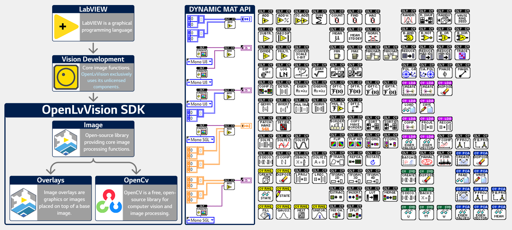

# OpenLvVision OpenCV

**OpenLvVision OpenCV** is a powerful LabVIEW wrapper for the **OpenCV** library. It brings advanced computer vision algorithms, linear algebra, and signal processing capabilities directly into LabVIEW, utilizing efficient **Mat** handling and polymorphic VIs.

📘 **Documentation:** For a complete reference of all functions and detailed usage, visit [openlvvision.org/docs/opencv/](https://openlvvision.org/docs/opencv/)
This library is currently in active development. Additional OpenCV modules will be included in future updates.

---

## 🔌 Dynamic MAT API

The **Mat** type is reconstructed as closely as possible using malleable and polymorphic VIs. If a function can be done in OpenCV C++, there is a high chance it will also work in the LabVIEW version.

---

## 🛠️ Functionality Overview

* 🧩**Core Functions**
    * **ArithmeticOperations:** `AbsDiff`, `Add`, `AddWeighted`, `ConvertScaleAbs`, `Divide`, `Exp`, `Log`, `Multiply`, `Pow`, `ScaleAdd`, `Sqrt`, `Subtract`, `Sum`
    * **BitwiseOperations:** `BitwiseAnd`, `BitwiseNot`, `BitwiseOr`, `BitwiseXor`
    * **ChannelManipulation:** `ExtractChannel`, `InsertChannel`, `LUT`, `Merge`, `MixChannels`, `Split`
    * **Comparison:** `CheckRange`, `Compare`, `InRange`
    * **DataConcatenation:** `Hconcat`, `Vconcat`
    * **FourierTransforms:** `Dct`, `Idct`, `Dft_Real`, `Dft_Complex`, `IDft_Real`, `IDft_Complex`, `GetOptimalDftSize`, `MulSpectrums`
    * **GeometricOperations:** `CartToPolar`, `PolarToCart`, `Magnitude`, `Phase`
    * **LinearAlgebra:** `CompleteSymm`, `Determinant`, `Eigen`, `EigenNonSymmetric`, `Gemm`, `Invert`, `MulTransposed`, `Norm`, `PatchNaNs`, `SetIdentity`, `Solve`, `SolveCubic`, `SolvePoly`
    * **MatrixImageTransformations:** `BorderInterpolate`, `CopyMakeBorder`, `Flip`, `FlipNd`, `PerspectiveTransform`, `Repeat`, `Rotate`, `TransformTo2D`, `TransformTo3D`, `TransformTo4D`, `Transpose`
    * **Reduction:** `Reduce`, `ReduceArgMax`, `ReduceArgMin`, `Trace`
    * **SimilarityMetrics:** `BatchDistance`, `Mahalanobis`, `PSNR`
    * **Sort:** `Sort`, `SortIdx`
    * **Statistical:** `CountNonZero`, `FindNonZero`, `HasNonZero`, `Max`, `Min`, `Mean`, `MeanStdDev`, `MinMaxIdx`, `MinMaxLoc`, `Normalize`
    * **LDA:** `SubspaceProject`, `SubspaceReconstruct`
    * **PCA:** `PCACompute`, `PCABackProject`, `PCAProject`
    * **SVD:** `SVBackSubst`, `SVDecomp`, `SVD_Compute`, `SVD_SolveZ`
    * **RandomNumber:** `Randn`, `RandShuffle`, `Randu`, `WriteRngSeed`

* 💻**System**
    * `CheckHardware`, `GetBuildInfos`, `GetNumThreads`, `GetVersion`, `SetNumThreads`

## 📦 Classes (Object-Oriented Wrappers)

* **LDA:** Create, Compute, Load/Save, Reconstruct, Project.
* **PCA:** Create, Compute, Read/Write, Project, BackProject.
* **SVD:** Create, Decompose, BackSubst, Read (U, VT, W).
* **RNG:** Create, Fill, Gaussian, Next, Read/Write State, Uniform (Int/Float/Double).

---

## 📥 Installation

1.  **Online:** Install the **OpenLvVision_Image** package directly via [VI Package Manager (VIPM)](https://www.vipm.io/publisher/openlvvision/).
2.  **Offline:** For offline installation, visit the [Installation Guide](https://openlvvision.org/docs/installation/openlvvision/).

### 🖥️ System Requirements
* **LabVIEW:** 2020 or newer (including the Community Edition)
* **OS:** Windows operating system
* **Dependencies:** NI Vision Development Module (license not required)

---

## ⚖️ Third Party Copyrights

* Copyright (C) 2000–2025, National Instruments Corporation, all rights reserved.
* Copyright (C) 2000-2022, Intel Corporation, all rights reserved.
* Copyright (C) 2009-2011, Willow Garage Inc., all rights reserved.
* Copyright (C) 2009-2016, NVIDIA Corporation, all rights reserved.
* Copyright (C) 2010-2013, Advanced Micro Devices, Inc., all rights reserved.
* Copyright (C) 2015-2023, OpenCV Foundation, all rights reserved.
* Copyright (C) 2008-2016, Itseez Inc., all rights reserved.
* Copyright (C) 2019-2023, Xperience AI, all rights reserved.
* Copyright (C) 2019-2022, Shenzhen Institute of Artificial Intelligence and Robotics for Society, all rights reserved.
* Copyright (C) 2022-2023, Southern University of Science And Technology, all rights reserved.
* Copyright (C) 2023-2025, John Medland, all rights reserved.
* Copyright (C) 2011-2014, The OpenBLAS Project, all rights reserved.

*Third party copyrights are property of their respective owners.*